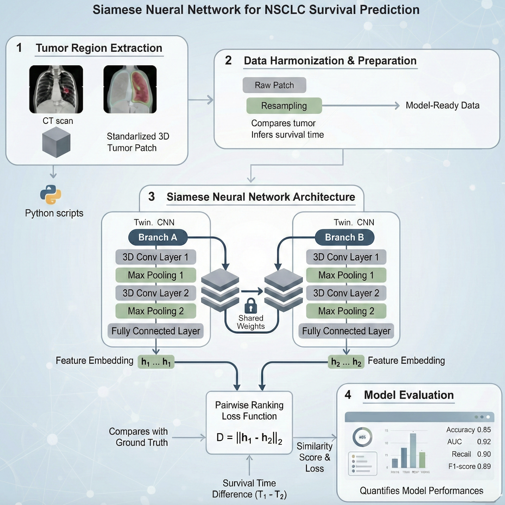

# Siamese-Neural Networks for survival time prediction
A Siamese Neural Network approach to predict survival time in patients with Non-Small Cell Lung Cancer (NSCLC) using CT images.

🧠 Methodology Overview

1️⃣ Tumor Region Extraction
Python scripts process each patient’s imaging data by combining:
CT scans
Segmentation masks
From these, the tumor regions are automatically located and cropped into standardized 3D patches for analysis.

2️⃣ Data Harmonization & Preparation
The extracted tumor patches undergo several preprocessing steps to make them suitable for deep learning:
🔄 Resampling to uniform voxel spacing
📦 Shape standardization (padding to fixed size)
🎚️ Intensity normalization
🧩 Packaging into model-ready datasets
These steps ensure that all inputs are consistent and ready for DL analysis.

3️⃣ Siamese Neural Network Training
A Siamese Neural Network is built to compare pairs of tumor patches.
Both branches (twins CNN) share the same weights and generate patient-level feature embeddings.
The network learns:
how tumor appearance relates to survival
similarity between paired inputs to infer survival time
Training uses a pairwise ranking loss derived from survival times.
Output:
A measure of how similar two patients are in terms of survival outcome — essentially, whether a pair of tumor images corresponds to patients with comparable survival times.

4️⃣ Model Evaluation
Model performance is assessed using standard classification metrics, including:
Accuracy
Area Under the Curve (AUC)
Precision
Recall
F1-score
These evaluations quantify how well the model predicts and ranks patient survival.
